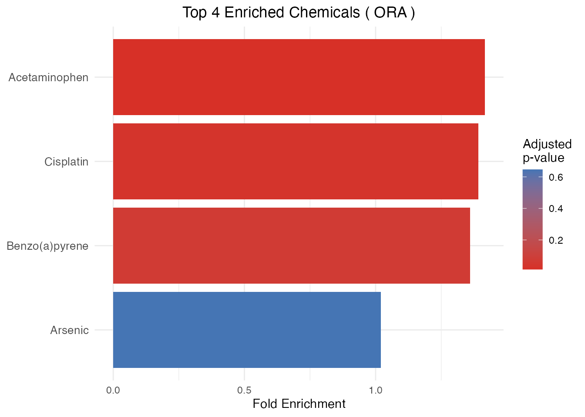
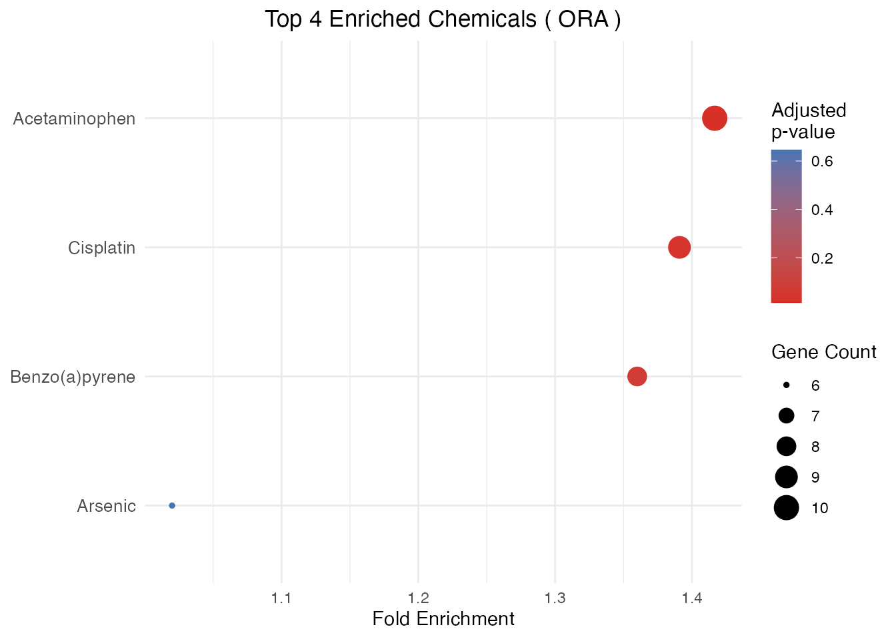
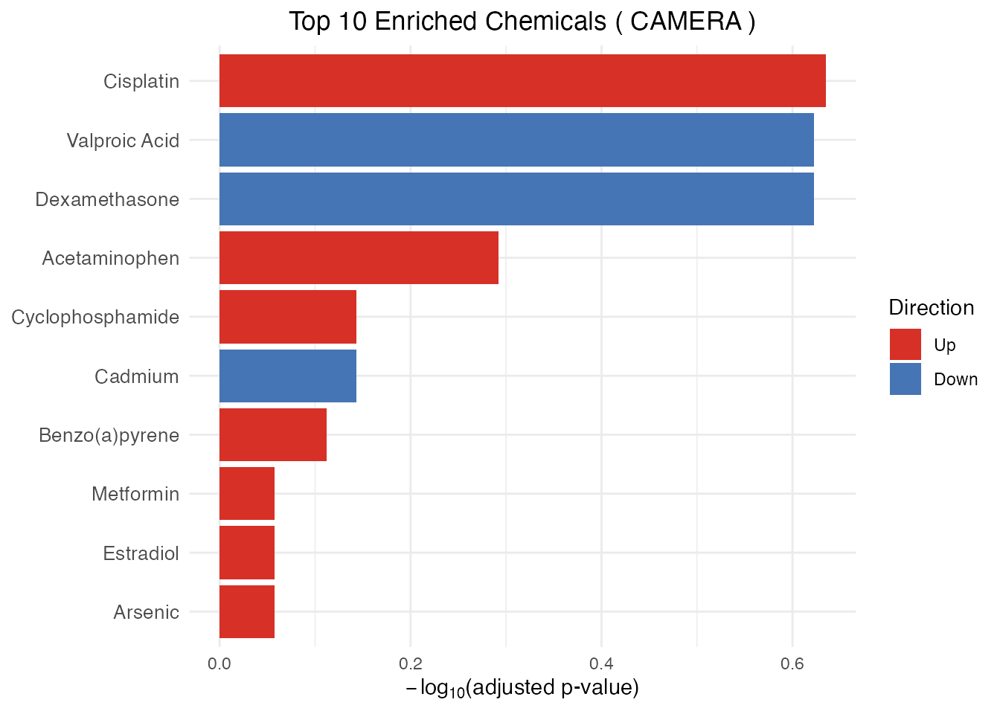
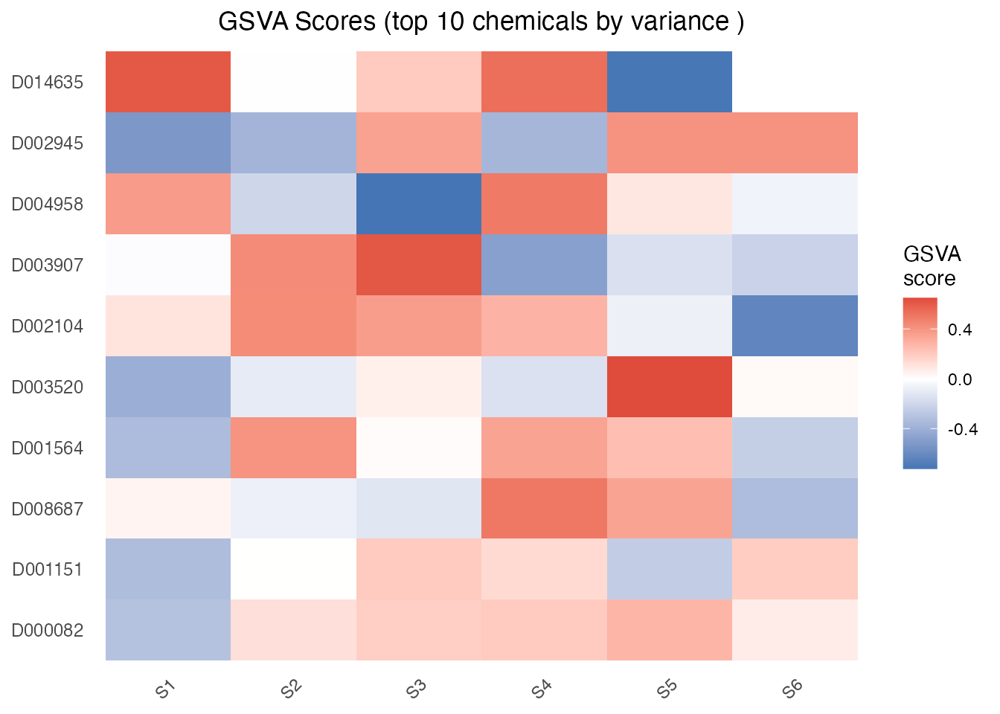

# Introduction to ctdR

## Overview

**ctdR** identifies chemicals significantly associated with a set of
genes using data from the [Comparative Toxicogenomics Database
(CTD)](https://ctdbase.org).

Four enrichment methods are supported through a single
[`enrichment_CTD()`](https://drake69.github.io/ctdR/reference/enrichment_CTD.md)
interface; the input shape depends on the method:

- **ORA** (Over-Representation Analysis) – gene list + hypergeometric
  test. Powered by
  [`clusterProfiler::enricher`](https://rdrr.io/pkg/clusterProfiler/man/enricher.html).
- **GSEA** (Gene Set Enrichment Analysis) – ranked gene list +
  permutation test. Powered by
  [`fgsea::fgsea`](https://rdrr.io/pkg/fgsea/man/fgsea.html).
- **CAMERA** (competitive gene-set test) – expression matrix + design +
  contrast. Corrects for inter-gene correlation within each chemical’s
  gene set. Powered by
  [`limma::camera`](https://rdrr.io/pkg/limma/man/camera.html).
- **GSVA** (Gene Set Variation Analysis) – expression matrix +
  per-sample scoring. Returns a chemical x sample score matrix. Powered
  by [`GSVA::gsva`](https://rdrr.io/pkg/GSVA/man/gsva.html).

## Data licensing disclaimer

> **This package does NOT bundle, redistribute, or embed any data from
> the Comparative Toxicogenomics Database.** CTD data are created and
> maintained by NC State University and are subject to specific
> licensing terms. Users must download the data directly from
> <https://ctdbase.org> and comply with the [CTD Terms of
> Service](https://ctdbase.org/about/legal.jsp).

## Installation

### From Bioconductor

    BiocManager::install("ctdR")

### From GitHub (development version)

    # install.packages("devtools")
    devtools::install_github("drake69/ctdR")

## Quick start

The ctdR workflow has three steps:

1.  **Download** the CTD data file (once, manually)
2.  **Import** the data into ctdR (once)
3.  **Analyse** your gene list (as many times as needed)

### Step 1 – Download CTD data

Download **`CTD_chem_gene_ixns.csv.gz`** from
<https://ctdbase.org/reports/CTD_chem_gene_ixns.csv.gz>.

Then decompress it:

``` bash
gunzip CTD_chem_gene_ixns.csv.gz
```

This produces `CTD_chem_gene_ixns.csv` (several GB uncompressed).

### Step 2 – Import into ctdR

In production you would run:

``` r

library(ctdR)
import_CTD("~/Downloads/CTD_chem_gene_ixns.csv")
```

For this vignette we use a small **synthetic** dataset bundled with the
package:

``` r

library(ctdR)
sample_file <- system.file(
    "extdata", "CTD_chem_gene_ixns_sample.csv",
    package = "ctdR"
)
import_CTD(sample_file)
#> Reading CTD chemical-gene interactions from: /Library/Frameworks/R.framework/Versions/4.6/Resources/library/ctdR/extdata/CTD_chem_gene_ixns_sample.csv
#> Filtered to 86 human interactions
#> Mapping genes for 10 chemicals (this may take a while)...
#> 
#> 'select()' returned 1:1 mapping between keys and columns
#> 'select()' returned 1:1 mapping between keys and columns
#> 'select()' returned 1:1 mapping between keys and columns
#> 'select()' returned 1:1 mapping between keys and columns
#> 'select()' returned 1:1 mapping between keys and columns
#> 'select()' returned 1:1 mapping between keys and columns
#> 'select()' returned 1:1 mapping between keys and columns
#> 'select()' returned 1:1 mapping between keys and columns
#> 'select()' returned 1:1 mapping between keys and columns
#> 'select()' returned 1:1 mapping between keys and columns
#> CTD data cached successfully in: ~/Library/Caches/ctdR
```

[`import_CTD()`](https://drake69.github.io/ctdR/reference/import_CTD.md)
performs the following:

1.  Reads the CSV (skipping the 27 CTD header lines).
2.  Filters interactions to **Homo sapiens** only (OrganismID 9606).
3.  Collects Entrez gene IDs for each chemical.
4.  Maps Entrez IDs to HGNC gene symbols via `org.Hs.eg.db`.
5.  Caches the processed data locally (under
    `rappdirs::user_cache_dir("ctdR")`).

This step takes several minutes with the full CTD file. You only need to
run it once – or again when you download a newer CTD release.

### Step 3 – Run enrichment analysis

#### Prepare your gene list

Your input must be a data frame with at least two columns:

| Column         | Description                           |
|----------------|---------------------------------------|
| `entrez_ids`   | Character or numeric Entrez gene IDs  |
| *(2nd column)* | Numeric value per gene (e.g. p-value) |

The second column is used for ranking in GSEA and is ignored in ORA.

``` r

genes <- data.frame(
    entrez_ids = c(
        "7124", "3569", "7157", "672", "1956",
        "4609", "3845", "207", "5290", "3553"
    ),
    pvalue = c(
        0.001, 0.003, 0.005, 0.008, 0.01,
        0.02, 0.03, 0.04, 0.05, 0.06
    )
)
```

#### Over-Representation Analysis (ORA)

ORA tests whether the overlap between your gene list and each chemical’s
known gene targets is significantly larger than expected by chance.

``` r

ora_results <- enrichment_CTD(genes, method = "ORA")
#> 'select()' returned 1:1 mapping between keys and columns
#> 
head(ora_results)
#>   ChemicalID GeneRatio BgRatio RichFactor FoldEnrichment    zScore      pvalue
#> 1    D000082     10/10   12/17  0.8333333       1.416667 3.0860670 0.003393665
#> 2    D001151      6/10   10/17  0.6000000       1.020000 0.1142857 0.646133278
#> 3    D001564      8/10   10/17  0.8000000       1.360000 2.0571429 0.052241876
#> 4    D002945      9/10   11/17  0.8181818       1.390909 2.5305065 0.017533937
#>         padj      qvalue                                            geneID
#> 1 0.01357466 0.007144558 TNF/IL6/EGFR/AKT1/TP53/MYC/KRAS/PIK3CA/BRCA1/IL1B
#> 2 0.64613328 0.340070147                       TNF/IL6/EGFR/AKT1/TP53/KRAS
#> 3 0.06965583 0.036660965           TNF/EGFR/AKT1/TP53/MYC/KRAS/PIK3CA/IL1B
#> 4 0.03506787 0.018456775      TNF/IL6/EGFR/AKT1/TP53/MYC/KRAS/PIK3CA/BRCA1
#>   Count foldEnrichment   ChemicalName
#> 1    10       1.416667  Acetaminophen
#> 2     6       1.020000        Arsenic
#> 3     8       1.360000 Benzo(a)pyrene
#> 4     9       1.390909      Cisplatin
```

**ORA output columns:**

| Column           | Description                          |
|------------------|--------------------------------------|
| `ChemicalID`     | CTD chemical identifier              |
| `ChemicalName`   | Human-readable chemical name         |
| `GeneRatio`      | Proportion of input genes in the set |
| `BgRatio`        | Background ratio                     |
| `pvalue`         | Raw p-value                          |
| `padj`           | Adjusted p-value (BH method)         |
| `foldEnrichment` | GeneRatio / BgRatio                  |
| `geneID`         | Enriched gene symbols                |
| `Count`          | Number of overlapping genes          |

#### Gene Set Enrichment Analysis (GSEA)

GSEA uses the full ranked gene list (ranked by the numeric column) to
detect chemicals whose targets cluster toward the top or bottom of the
ranking.

``` r

gsea_results <- enrichment_CTD(genes, method = "GSEA")
#> Warning in prepareStats(stats, scoreType, gseaParam): All values in the stats
#> vector are greater than zero and scoreType is "std", maybe you should switch to
#> scoreType = "pos".
head(gsea_results)
#>   ChemicalID       pval      padj    log2err         ES       NES size
#> 1    D001151 0.32507289 0.4179509 0.08528847  0.6138938  1.216069    6
#> 2    D001564 0.30193906 0.4179509 0.13077714 -0.6329866 -1.174854    8
#> 3    D002104 0.13411079 0.3017493 0.14375899  0.6661635  1.319611    6
#> 4    D002945 0.20100503 0.3618090 0.12384217  1.0000000  1.244519    9
#> 5    D003520 0.42097027 0.4209703 0.07530938  0.5714286  1.090690    3
#> 6    D003907 0.05477308 0.2347418 0.24133998  0.8188439  1.562933    3
#>    leadingEdge foldEnrichment     ChemicalName             Enriched_GENE
#> 1 7124, 35....       1.531849          Arsenic          1, 2, 3, 5, 7, 8
#> 2 3553, 52....       1.579491   Benzo(a)pyrene   1, 3, 5, 6, 7, 8, 9, 10
#> 3 7124, 35....       1.662278          Cadmium         1, 2, 3, 8, 9, 10
#> 4 7124, 35....       2.495300        Cisplatin 1, 2, 3, 4, 5, 6, 7, 8, 9
#> 5 7157, 67....       1.425886 Cyclophosphamide                   3, 4, 6
#> 6   7124, 3569       2.043261    Dexamethasone                  1, 2, 10
```

**GSEA output columns:**

| Column           | Description                    |
|------------------|--------------------------------|
| `ChemicalID`     | CTD chemical identifier        |
| `ChemicalName`   | Human-readable chemical name   |
| `pval`           | Raw p-value                    |
| `padj`           | Adjusted p-value               |
| `ES`             | Enrichment score               |
| `NES`            | Normalized enrichment score    |
| `size`           | Size of the gene set           |
| `leadingEdge`    | Leading-edge gene subset       |
| `foldEnrichment` | abs(ES) / mean(ES)             |
| `Enriched_GENE`  | Comma-separated enriched genes |

#### Build a synthetic expression matrix for CAMERA and GSVA

CAMERA and GSVA take a gene x sample expression matrix (typically log2
counts or microarray intensities). For this vignette we build a small
synthetic matrix using the Entrez IDs already loaded by
[`import_CTD()`](https://drake69.github.io/ctdR/reference/import_CTD.md)
above:

``` r

# Pull the Entrez IDs covered by the bundled sample
cache_dir <- rappdirs::user_cache_dir("ctdR")
e <- new.env(parent = emptyenv())
load(file.path(cache_dir, "ChemicalName_GeneEntrezIds.rda"),
    envir = e)
all_ids <- as.character(unique(unlist(
    e$ChemicalName_GeneEntrezIds)))

# Synthetic expression matrix: 17 genes x 6 samples
set.seed(2026)
expr <- matrix(
    rnorm(length(all_ids) * 6),
    nrow = length(all_ids), ncol = 6,
    dimnames = list(all_ids, paste0("S", 1:6))
)
dim(expr)
#> [1] 17  6
```

#### CAMERA (competitive test with inter-gene correlation)

CAMERA tests, for each chemical, whether its target genes show a
stronger differential signal than the rest of the transcriptome under a
user-supplied design and contrast, while correcting for inter-gene
correlation within the gene set.

``` r

grp <- factor(rep(c("ctrl", "treat"), each = 3))
design <- model.matrix(~ grp)

camera_results <- enrichment_CTD(
    expr,
    method   = "CAMERA",
    design   = design,
    contrast = 2  # last column of design = treat vs ctrl
)
head(camera_results)
#>   ChemicalID     ChemicalName NGenes Direction     pvalue      padj
#> 1    D002945        Cisplatin     11        Up 0.02319375 0.2319375
#> 2    D003907    Dexamethasone      7      Down 0.07151516 0.2383839
#> 3    D014635    Valproic Acid      8      Down 0.05895320 0.2383839
#> 4    D000082    Acetaminophen     12        Up 0.20432247 0.5108062
#> 5    D002104          Cadmium      8      Down 0.39170306 0.7189345
#> 6    D003520 Cyclophosphamide      5        Up 0.43136072 0.7189345
```

**CAMERA output columns:** `ChemicalID`, `ChemicalName`, `NGenes` (gene
set size after intersection with rownames), `Direction` (`"Up"` /
`"Down"`), `pvalue`, `padj`.

#### GSVA (per-sample scoring)

GSVA produces a **per-sample** enrichment score for each chemical,
returning a matrix (chemicals in rows, samples in columns) suitable for
clustering, association tests against phenotypes, survival analysis, or
heatmap visualization.

``` r

gsva_scores <- enrichment_CTD(expr, method = "GSVA")
#> ℹ GSVA version 2.6.1
#> ℹ Searching for rows with constant values
#> ℹ Calculating GSVA ranks
#> ℹ kcdf='auto' (default)
#> ℹ GSVA dense (classical) algorithm
#> ℹ Row-wise ECDF estimation with Gaussian kernels
#> ℹ Calculating row ECDFs
#> ℹ Calculating column ranks
#> ℹ GSVA dense (classical) algorithm
#> ℹ Calculating GSVA scores for 10 gene sets
#> ✔ Calculations finished
dim(gsva_scores)  # chemicals x samples
#> [1] 10  6
head(gsva_scores, 3)
#>                 S1        S2         S3        S4         S5          S6
#> D000082 -0.3073171 0.1181818 0.18181818 0.2000000  0.2770833  0.07017544
#> D001564 -0.3370536 0.4025974 0.01567944 0.3458647  0.2408638 -0.24068323
#> D002104  0.1014493 0.4313725 0.36585366 0.2833333 -0.0751634 -0.62903226
```

Tune the underlying
[`GSVA::gsvaParam()`](https://rdrr.io/pkg/GSVA/man/gsvaParam-class.html)
through `...`, for example to restrict to gene sets of a given size:

``` r

gsva_strict <- enrichment_CTD(
    expr, method = "GSVA",
    minSize = 5, maxSize = 500
)
#> ℹ GSVA version 2.6.1
#> ℹ Searching for rows with constant values
#> ℹ Calculating GSVA ranks
#> ℹ kcdf='auto' (default)
#> ℹ GSVA dense (classical) algorithm
#> ℹ Row-wise ECDF estimation with Gaussian kernels
#> ℹ Calculating row ECDFs
#> ℹ Calculating column ranks
#> ℹ GSVA dense (classical) algorithm
#> ℹ Calculating GSVA scores for 10 gene sets
#> ✔ Calculations finished
nrow(gsva_strict)
#> [1] 10
```

### Visualizing results

[`plot_CTD()`](https://drake69.github.io/ctdR/reference/plot_CTD.md)
creates publication-ready plots from enrichment results. It auto-detects
the method: bar/dot plots of fold enrichment for ORA/GSEA, bar/dot plots
of `-log10(padj)` coloured by direction for CAMERA, and a sample-level
heatmap of the top-variance chemicals for GSVA.

``` r

# ORA bar plot of top enriched chemicals
plot_CTD(ora_results, type = "bar")
```



``` r

# ORA dot plot (size = gene count, color = adjusted p-value)
plot_CTD(ora_results, type = "dot", n = 10)
```



``` r

# CAMERA bar plot: x-axis = -log10(padj), fill = Direction
plot_CTD(camera_results, type = "bar")
```



``` r

# GSVA heatmap: top-variance chemicals across samples
plot_CTD(gsva_scores)
```



### Adjusting for multiple testing

By default,
[`enrichment_CTD()`](https://drake69.github.io/ctdR/reference/enrichment_CTD.md)
uses the Benjamini-Hochberg (`"BH"`) method for p-value adjustment. You
can change this via the `pAdjustMethod` parameter:

``` r

# Bonferroni correction (more conservative)
ora_bonf <- enrichment_CTD(genes, method = "ORA",
    pAdjustMethod = "bonferroni")
#> 'select()' returned 1:1 mapping between keys and columns

# No adjustment
ora_raw <- enrichment_CTD(genes, method = "ORA",
    pAdjustMethod = "none")
#> 'select()' returned 1:1 mapping between keys and columns

# Compare the adjusted p-value of the top hit
data.frame(
    method = c("BH (default)", "bonferroni", "none"),
    top_padj = c(min(ora_results$padj),
        min(ora_bonf$padj), min(ora_raw$padj))
)
#>         method    top_padj
#> 1 BH (default) 0.013574661
#> 2   bonferroni 0.013574661
#> 3         none 0.003393665
```

Available methods: `"BH"` (default), `"bonferroni"`, `"fdr"` (alias for
BH), `"none"`.

## Choosing among the four methods

| Aspect | ORA | GSEA | CAMERA | GSVA |
|----|----|----|----|----|
| **Input** | Gene list | Ranked gene list | Expression matrix + design + contrast | Expression matrix |
| **Question** | Over-represented? | Cluster at extremes? | Stronger signal than rest of transcriptome (correlation-corrected)? | Per-sample chemical score |
| **Output** | Ranked chemicals (data.frame) | Ranked chemicals (data.frame) | Ranked chemicals (data.frame) | Chemical x sample score matrix |
| **Best for** | DEG lists | Exploratory, ranked | Multi-sample DE experiments, co-regulated gene sets | Patient stratification, downstream tests, heatmaps |

Use **ORA** when you have a well-defined gene list above a significance
threshold; **GSEA** to leverage the full ranking without a cutoff;
**CAMERA** when you have a proper multi-sample design and want to
control the inflated false-positive rate that ORA/GSEA exhibit on
strongly co-regulated gene sets; **GSVA** when you want a per-sample
score to feed into downstream analyses (clustering, survival,
correlation with phenotypes).

## Updating the CTD data

CTD releases updated data periodically. To update:

1.  Download the latest `CTD_chem_gene_ixns.csv.gz` from
    <https://ctdbase.org/reports/CTD_chem_gene_ixns.csv.gz>.
2.  Decompress and re-run
    [`import_CTD()`](https://drake69.github.io/ctdR/reference/import_CTD.md)
    – existing cache files are overwritten.

``` r

import_CTD("~/Downloads/CTD_chem_gene_ixns.csv")
```

## Session info

``` r

sessionInfo()
#> R version 4.6.0 (2026-04-24)
#> Platform: aarch64-apple-darwin23
#> Running under: macOS Tahoe 26.3.1
#> 
#> Matrix products: default
#> BLAS:   /Library/Frameworks/R.framework/Versions/4.6/Resources/lib/libRblas.0.dylib 
#> LAPACK: /Library/Frameworks/R.framework/Versions/4.6/Resources/lib/libRlapack.dylib;  LAPACK version 3.12.1
#> 
#> locale:
#> [1] en_US.UTF-8/en_US.UTF-8/en_US.UTF-8/C/en_US.UTF-8/en_US.UTF-8
#> 
#> time zone: Europe/Rome
#> tzcode source: internal
#> 
#> attached base packages:
#> [1] stats     graphics  grDevices utils     datasets  methods   base     
#> 
#> other attached packages:
#> [1] ctdR_0.99.2      BiocStyle_2.40.0
#> 
#> loaded via a namespace (and not attached):
#>   [1] RColorBrewer_1.1-3          jsonlite_2.0.0             
#>   [3] tidydr_0.0.6                magrittr_2.0.5             
#>   [5] magick_2.9.1                ggtangle_0.1.2             
#>   [7] farver_2.1.2                rmarkdown_2.31             
#>   [9] fs_2.1.0                    ragg_1.5.2                 
#>  [11] vctrs_0.7.3                 DelayedMatrixStats_1.34.0  
#>  [13] memoise_2.0.1               ggtree_4.2.0               
#>  [15] S4Arrays_1.12.0             htmltools_0.5.9            
#>  [17] Rhdf5lib_2.0.0              rhdf5_2.56.0               
#>  [19] SparseArray_1.12.2          gridGraphics_0.5-1         
#>  [21] sass_0.4.10                 bslib_0.10.0               
#>  [23] htmlwidgets_1.6.4           desc_1.4.3                 
#>  [25] plyr_1.8.9                  httr2_1.2.2                
#>  [27] cachem_1.1.0                igraph_2.3.1               
#>  [29] lifecycle_1.0.5             pkgconfig_2.0.3            
#>  [31] rsvd_1.0.5                  Matrix_1.7-5               
#>  [33] R6_2.6.1                    fastmap_1.2.0              
#>  [35] gson_0.1.0                  MatrixGenerics_1.24.0      
#>  [37] digest_0.6.39               aplot_0.2.9                
#>  [39] enrichplot_1.32.0           ggnewscale_0.5.2           
#>  [41] patchwork_1.3.2             AnnotationDbi_1.74.0       
#>  [43] S4Vectors_0.50.0            aisdk_1.1.0                
#>  [45] irlba_2.3.7                 GenomicRanges_1.64.0       
#>  [47] textshaping_1.0.5           RSQLite_3.52.0             
#>  [49] beachmat_2.28.0             org.Hs.eg.db_3.23.1        
#>  [51] labeling_0.4.3              abind_1.4-8                
#>  [53] httr_1.4.8                  polyclip_1.10-7            
#>  [55] compiler_4.6.0              bit64_4.8.0                
#>  [57] fontquiver_0.2.1            withr_3.0.2                
#>  [59] S7_0.2.2                    BiocParallel_1.46.0        
#>  [61] DBI_1.3.0                   HDF5Array_1.40.0           
#>  [63] ggforce_0.5.0               MASS_7.3-65                
#>  [65] rappdirs_0.3.4              DelayedArray_0.38.1        
#>  [67] rjson_0.2.23                tools_4.6.0                
#>  [69] otel_0.2.0                  ape_5.8-1                  
#>  [71] scatterpie_0.2.6            glue_1.8.1                 
#>  [73] h5mread_1.4.0               callr_3.7.6                
#>  [75] rhdf5filters_1.24.0         nlme_3.1-169               
#>  [77] GOSemSim_2.38.0             grid_4.6.0                 
#>  [79] cluster_2.1.8.2             reshape2_1.4.5             
#>  [81] memuse_4.2-3                fgsea_1.38.0               
#>  [83] generics_0.1.4              gtable_0.3.6               
#>  [85] tzdb_0.5.0                  tidyr_1.3.2                
#>  [87] data.table_1.18.4           hms_1.1.4                  
#>  [89] ScaledMatrix_1.20.0         BiocSingular_1.28.0        
#>  [91] XVector_0.52.0              BiocGenerics_0.58.0        
#>  [93] ggrepel_0.9.8               pillar_1.11.1              
#>  [95] stringr_1.6.0               yulab.utils_0.2.4          
#>  [97] vroom_1.7.1                 GSVA_2.6.1                 
#>  [99] limma_3.68.2                splines_4.6.0              
#> [101] dplyr_1.2.1                 tweenr_2.0.3               
#> [103] treeio_1.36.1               lattice_0.22-9             
#> [105] bit_4.6.0                   annotate_1.90.0            
#> [107] tidyselect_1.2.1            SingleCellExperiment_1.34.0
#> [109] fontLiberation_0.1.0        GO.db_3.23.1               
#> [111] Biostrings_2.80.0           knitr_1.51                 
#> [113] fontBitstreamVera_0.1.1     bookdown_0.46              
#> [115] IRanges_2.46.0              Seqinfo_1.2.0              
#> [117] SummarizedExperiment_1.42.0 stats4_4.6.0               
#> [119] xfun_0.57                   Biobase_2.72.0             
#> [121] statmod_1.5.1               matrixStats_1.5.0          
#> [123] stringi_1.8.7               lazyeval_0.2.3             
#> [125] ggfun_0.2.0                 yaml_2.3.12                
#> [127] evaluate_1.0.5              codetools_0.2-20           
#> [129] gdtools_0.5.0               tibble_3.3.1               
#> [131] qvalue_2.44.0               graph_1.90.0               
#> [133] BiocManager_1.30.27         ggplotify_0.1.3            
#> [135] cli_3.6.6                   xtable_1.8-8               
#> [137] systemfonts_1.3.2           processx_3.9.0             
#> [139] jquerylib_0.1.4             Rcpp_1.1.1-1.1             
#> [141] png_0.1-9                   XML_3.99-0.23              
#> [143] parallel_4.6.0              pkgdown_2.2.0              
#> [145] ggplot2_4.0.3               readr_2.2.0                
#> [147] blob_1.3.0                  clusterProfiler_4.20.0     
#> [149] DOSE_4.6.0                  sparseMatrixStats_1.24.0   
#> [151] SpatialExperiment_1.22.0    GSEABase_1.74.0            
#> [153] tidytree_0.4.7              ggiraph_0.9.6              
#> [155] enrichit_0.1.4              scales_1.4.0               
#> [157] purrr_1.2.2                 crayon_1.5.3               
#> [159] rlang_1.2.0                 cowplot_1.2.0              
#> [161] fastmatch_1.1-8             KEGGREST_1.52.0
```
